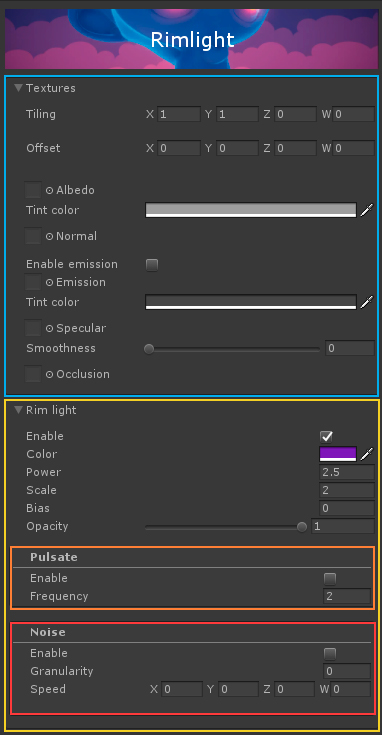
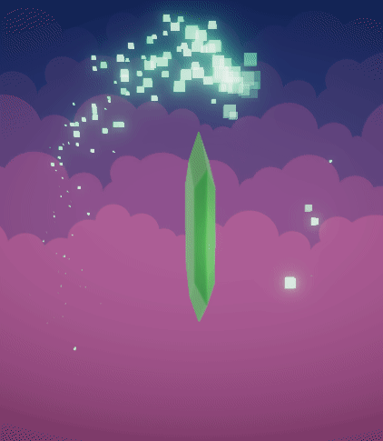

# Rimlight     

Rim lighting is a light that usually comes from beside or behind a subject, and enhances its silhouette. This shader fakes this by making use of the Fresnel effect.

This can be used to stylize or highlight objects, and it greatly favors certain artstyles. It is especially pleasing when applied to smooth curvy models.

It can be edited through [Amplify Shader Editor](http://amplify.pt/unity/amplify-shader-editor) and contributions to the project are always welcome!

---

Project developed using **Unity 2017.4.8f1**. Please use this version if you are planning on contributing. You can work on your own branch and send a pull request with your changes.

---

_(Beware: The media folder is quite heavy at the moment, I need to find a way to reduce file size for gifs without losing too much quality)_

You can also just download a **unitypackage** (lightweight) from the [releases tab](https://github.com/AdultLink/Rimlight/releases) and easily import everything to your project. This will not download the _screenshots_ folder. It is recommended to download the whole project only for testing purposes and to get familiar with the shader, and only import the shader itself and the editor folder into your own projects.

_Disclaimer: The scripts controlling the behavior of the examples provided are not optimized in any way and should only be taken as quick & dirty examples._

Third-party (free) assets used in this project:
- [Farland Skies - Cloudy Crown, by BORODAR](https://assetstore.unity.com/packages/2d/textures-materials/sky/farland-skies-cloudy-crown-60004)

# Table of contents
1. [Getting started](#getting-started)
2. [Usage & parameters](#usage-parameters)
    - 2.1 [Texture settings](#texture-settings)
    - 2.2 [Rimlight settings](#rimlight-settings)
      - 2.2.1 [Pulsate](#pulsate)
      - 2.2.2 [Noise](#noise)
3. [Examples](#examples)
4. [Donate](#donate)
5. [License](#license)

# Getting started
Setup is minimal, all you need to do is create a new material that uses the shader and assign it to your meshRenderer, then just play around with settings.

# Usage, parameters

This shader is comprised of a few "modules", that work independently and can be activated/deactivated without affecting each other.

## Texture settings

Your regular texture maps. Use as you would with the standard shader. Includes `Albedo`, `Normal`, `Emission`, `Specular` and `Occlusion`.

## Rimlight settings

These are also pretty self-explanatory. Allows you to tweak the appearance of the rim light, including `Color`, `Power`, `Scale`, `Bias` (barely used) and `Opacity`.

### Pulsate

By enabling this, you get a nice on & off pulsation effect. Could come in handy! `Frequency` determines pulsation speed.

### Noise

Always add some noise to whatever you are doing! This helps achieve a more "organic" / "less clean" look. `Granularity` determines noise scale. It can also be animated by setting a `Speed` value != 0.

# Examples

Although this shader really shines when used on smooth curvy meshes, it also offers a lot when dealing with angular shapes, as it can really make colors pop in some cases!

# Donate 

This piece of software is offered for free because I believe the gamedev community can benefit from it, and it should not be behind a paywall. I learned from the community, and now I am giving back.

If you would like to support me, donations are very much appreciated, since they help me create more software that I can offer for free.

Thank you very much :)

# License
MIT License

Copyright (c) 2018 Guillermo Angel

Permission is hereby granted, free of charge, to any person obtaining a copy
of this software and associated documentation files (the "Software"), to deal
in the Software without restriction, including without limitation the rights
to use, copy, modify, merge, publish, distribute, sublicense, and/or sell
copies of the Software, and to permit persons to whom the Software is
furnished to do so, subject to the following conditions:

The above copyright notice and this permission notice shall be included in all
copies or substantial portions of the Software.

THE SOFTWARE IS PROVIDED "AS IS", WITHOUT WARRANTY OF ANY KIND, EXPRESS OR
IMPLIED, INCLUDING BUT NOT LIMITED TO THE WARRANTIES OF MERCHANTABILITY,
FITNESS FOR A PARTICULAR PURPOSE AND NONINFRINGEMENT. IN NO EVENT SHALL THE
AUTHORS OR COPYRIGHT HOLDERS BE LIABLE FOR ANY CLAIM, DAMAGES OR OTHER
LIABILITY, WHETHER IN AN ACTION OF CONTRACT, TORT OR OTHERWISE, ARISING FROM,
OUT OF OR IN CONNECTION WITH THE SOFTWARE OR THE USE OR OTHER DEALINGS IN THE
SOFTWARE.

